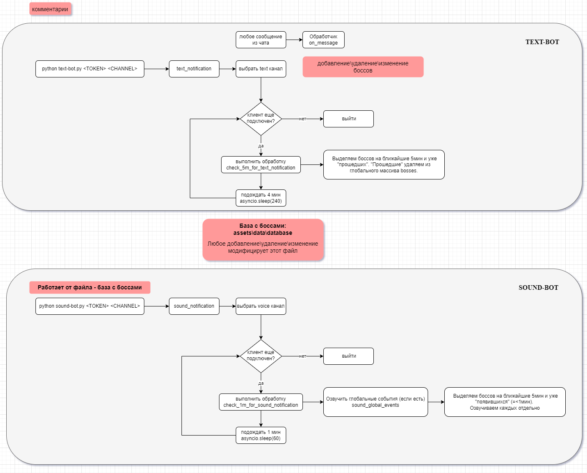

## L2M Boss Notifier

## 0. Project overview.



## 1. How to start?

Here are two ways to start bots: manual (3 and 4) OR auto with docker (5 or 6)

## 2. Preinstall packages for server:

Installing needed libraries for voice-bot
```
sudo apt-get install ffmpeg  
sudo apt-get install frei0r-plugins
```
Creating and activating python virtual environment
```
cd l2m-discord-notifier-bot
python3 -m venv env
source ./env/bin/activate
pip install -r requirements.txt
```
## 3. Manual. Run text bot:

Permissions: 
- General: read messages
- Text: Send messages

```
<discord link for adding bot to chanel>

screen -S "l2m textbot"
python text-bot.py <TOKEN> <CHANNEL>
[CTRL+A] [D]
screen -ls
```

## 4. Manual. Run voice bots:

Permissions: 
- General: read messages
- Text: Send messages
- Voice: Connect, Speak

```
<discord link for adding bot to chanel>

screen -S "l2m voicebot РБ"
python sound-bot.py <TOKEN> <CHANNEL>
[CTRL+A] [D]
screen -ls
```
```
<discord link for adding bot to chanel>

screen -S "l2m voicebot MADR"
python sound-bot.py <TOKEN> <CHANNEL>
[CTRL+A] [D]
screen -ls
```
```
<discord link for adding bot to chanel>

screen -S "l2m voicebot CALVADOS"
python sound-bot.py <TOKEN> <CHANNEL>
[CTRL+A] [D]
screen -ls
```
```
<discord link for adding bot to chanel>

screen -S "l2m voicebot MUTE"
python sound-bot.py <TOKEN> <CHANNEL>
[CTRL+A] [D]
screen -ls
```

## 5. Auto. Docker images. Build and run bots:
```
docker build --build-arg TOKEN=TOKEN,CHANNEL=CHANNEL,SCRIPT_NAME=SCRIPT_NAME -f textbot.Dockerfile --tag discord-bot:latest .

docker run -e TOKEN=<TOKEN> -e CHANNEL=general -e SCRIPT_NAME=text-bot.py --name=textbot -v ./assets:/assets discord-bot

docker run -e TOKEN=<TOKEN> -e CHANNEL=РБ -e SCRIPT_NAME=sound-bot.py --name=voicebot_1 -v ./assets:/assets discord-bot
docker run -e TOKEN=<TOKEN> -e CHANNEL=MADR -e SCRIPT_NAME=sound-bot.py --name=voicebot_2 -v ./assets:/assets discord-bot
docker run -e TOKEN=<TOKEN> -e CHANNEL=CALVADOS -e SCRIPT_NAME=sound-bot.py --name=voicebot_3 -v ./assets:/assets discord-bot
docker run -e TOKEN=<TOKEN> -e CHANNEL=!БЕЗ_ФЛУДА(Бот_РБ) -e SCRIPT_NAME=sound-bot.py --name=voicebot_4 -v ./assets:/assets discord-bot
```

## 6. Auto. Docker Compose.

Checkout tokens and channels in `docker-compose.yaml`.

- `docker-compose up --build` (rebuild and start)
- `docker-compose top` (check status)
- `docker-compose down` (stop all instances)
